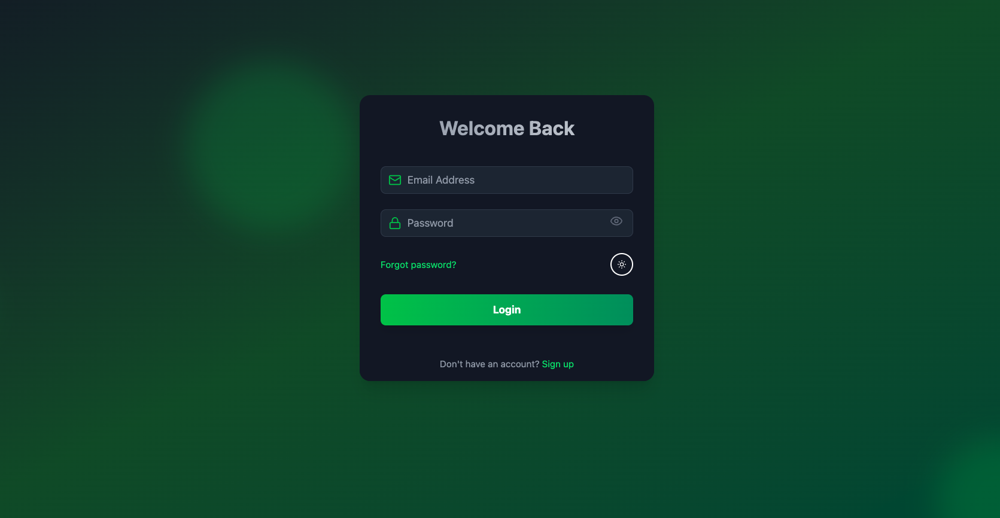
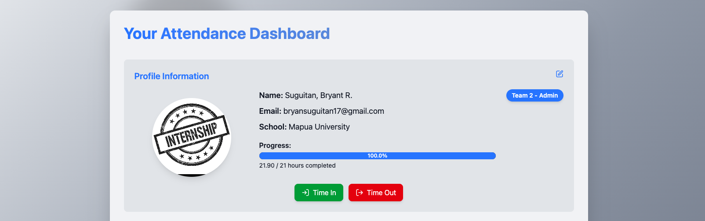
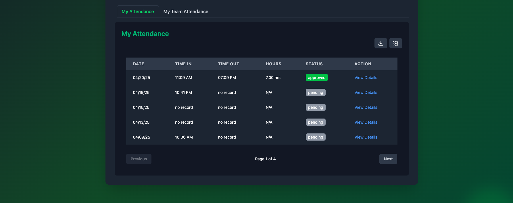
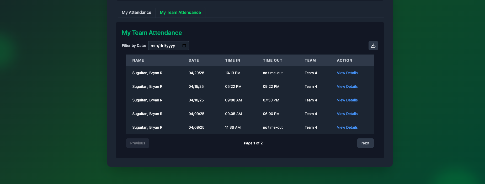
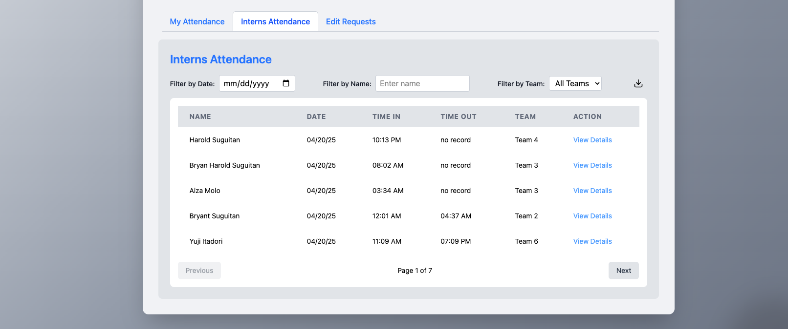
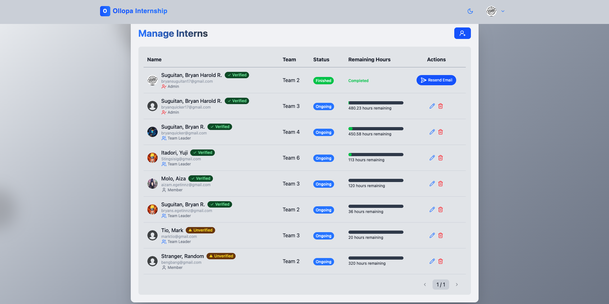
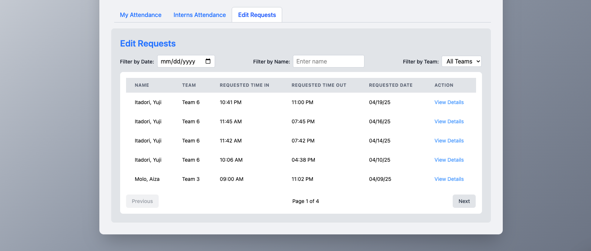

# Intern Attendance System Web App

> 🚀 **Special Project for Ollopa Corporation Internship**

The Intern Attendance System is a web-based application designed to streamline attendance tracking and user management for interns, team leaders, and administrators.

---

## 👤 Users and Roles

- **Admin**: Full access to all features.
- **Team Leader (TL)**: Can view their team's attendance.
- **Member**: Can manage their own attendance and request edits.

---

## 🌐 General UI Features

### 1. Theme Support
- Light Mode / Dark Mode toggle available globally.

### 2. Header
- Always visible at the top of every page.
- Includes links to:
  - Landing Page
- User Dropdown displays:
  - Name
  - Email
  - Link to Dashboard
  - (Admin only) Manage Users
  - Logout

### 3. Footer
- Present on all pages.
- Links to:
  - 3 Company Websites
  - [<brynsgtn />](https://your-portfolio-link.com) – Developer’s Personal Portfolio

---

## 🔐 Authentication and Access Flow

### Landing Page
- **Logged Out**: Sign Up and Login buttons.
- **Logged In**: "Get Started" button redirects to dashboard.

### Sign Up
- Register with a new account or log in with existing credentials.
- Verification email sent (valid for 5 minutes).
- Enter code, resend, or simulate invalid codes.

### Forgot Password
- Receive reset link (valid for 5 minutes).
- Use link to reset password.

### Login
- Validations for:
  - Incorrect email
  - Unverified email
  - Existing valid account

---

## 📊 Dashboard Features

### Profile
- All users can edit their profile info.

### Time-In / Time-Out
- **Time-In**: Available to all users.
- **Time-Out**: Only after a valid time-in.

#### Attendance Status
- **Incomplete**: Time-in only.
- **Completed**: Time-in and time-out.

#### Attendance Hours
- N/A if incomplete or < 1 hour.
- > 5 hrs: 1 hr lunch deducted.
- 4–5 hrs: capped at 4 hrs.
- Counted only between 9 AM – 6 PM (PHT).

### My Attendance
- View and delete personal records.

#### Edit Requests
- TLs & Members: Require admin approval.
- Admin: Immediate effect.

Validations:
- Cannot edit non-existent dates
- Cannot edit if pending requests exist
- Cannot edit time before 9 AM
- Timeout must be after time-in

#### Create Attendance
- TLs & Members: Need approval.
- Admin: No approval needed.

Restrictions:
- No future dates
- No duplicates
- Timeout cannot precede time-in

#### Extras:
- Pagination: 5 records/page
- Export to Excel

---

## 🛠️ Admin-Only Features

### 1. Intern Attendance
- Filter by name, date, or team.
- Export data to Excel.
- View by date.
- Pagination: 5 records/page.

### 2. Edit Requests
- Filter, view, approve, or reject.
- Add rejection reasons.
- Pagination: 5 records/page.

### 3. Manage Interns
- View/edit/delete interns.
- Assign teams and roles.
- Send/resend completion emails.
- Create new (unverified) accounts.
- Pagination: 10 interns/page.

---

## 👥 Team Leader Features

### My Team Attendance
- Filter by date.
- Export data to Excel.
- View by date.
- Pagination: 5 records/page.

---

## 📸 Screenshots

> Here are a few UI previews of the Intern Attendance System Web App:

### 🏁 Landing Page

### 🔒 Authentication Pages

### 🏠 Dashboard

### 📅 Attendance Management

### 🛠️ Admin Panel

---

## 📌 Scope and Limitations

### ✅ Scope
- Web-based intern attendance and user management system.
- Supports three user roles: Admin, TL, Member.
- Core Features:
  - Email Auth (Login, Signup, Reset, Verification)
  - Role-Based Dashboards
  - Time-In/Out with Attendance Rules
  - Edit Requests & Manual Entries
  - Excel Export
  - JWT & bcrypt Security
  - Mailtrap Email Integration
  - UI with Light/Dark Mode

### ⚠️ Limitations

#### 📧 Email Restrictions
- Max 1,000 emails/month (Mailtrap free tier).
- For dev/testing only, not production.

#### 🌐 Deployment Constraints
- Hosted on Render (Free Tier):
  - May experience cold starts.
  - Limited resources for high traffic.

#### 🕒 Time Constraints
- Attendance counted only between 9 AM – 6 PM (PHT).
- All time entries converted to Philippine Time.
- Time > 5 hrs: deduct 1 hr for lunch.
- 4–5 hrs: capped at 4 hrs.

#### 👤 Verification Required
- Unverified users blocked from dashboard access.

#### 📊 Display Limits
- 5 records/page (Attendance, Requests)
- 10 records/page (User Management)

#### 🔐 Security & Data Handling
- JWT for sessions
- Passwords encrypted via bcrypt
- Not built for highly sensitive enterprise data

---

## 🙌 Acknowledgments

Built with 💻 and ☕ by **Bryan Harold R. Suguitan** for **Ollopa Corporation Internship Program**.

